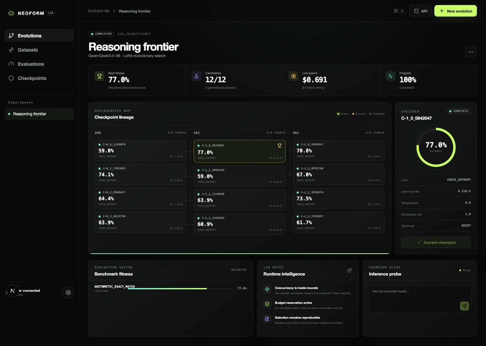

<div align="center">
  <h1>NEOFORM</h1>
  <p><strong>Open-source evolutionary post-training for Tinker.</strong></p>
  <p>
    Branch LoRA candidates. Measure real fitness. Promote only the model that earns it.
  </p>
  <p>
    <a href="https://github.com/krishgolcha/neoform/actions">CI</a> ·
    <a href="https://www.apache.org/licenses/LICENSE-2.0">Apache-2.0</a> ·
    <a href="https://tinker-docs.thinkingmachines.ai/">Tinker documentation</a>
  </p>
</div>



NEOFORM is a local-first research lab that sits above the
[Tinker API](https://github.com/thinking-machines-lab/tinker). It creates competing
LoRA branches, applies deterministic hyperparameter mutations, evaluates every
checkpoint, enforces a conservative spend ceiling, and keeps promotion manual.

> [!IMPORTANT]
> NEOFORM is an independent, unofficial open-source project created and maintained
> by **Krish Golcha**. It is not endorsed by or affiliated with Thinking Machines Lab.

## What it adds

- A checkpoint lineage canvas with live candidate state and evidence.
- Durable evolution orchestration with pause, resume, cancellation, and recovery.
- Worst-case token reservations that stop work before it can exceed the configured cap.
- Deterministic mutation and weighted evaluation scoring, with a bundled arithmetic
  exact-match evaluator for live smoke-scale experiments.
- Sampler checkpoint probes before evaluation.
- A manually controlled `neoform://evolutions/{id}/champion` inference alias.
- REST, replayable server-sent events, a Python CLI, and a polished local web lab.

## Quick start

Requirements: Python 3.11+, `uv`, Node.js 20+, `pnpm`, a funded Tinker account,
and a Tinker API key.

```bash
git clone https://github.com/krishgolcha/neoform.git
cd neoform
export TINKER_API_KEY="your-key"

cd extensions/neoform
uv sync --extra dev
uv run neoform doctor
uv run neoform serve
```

In a second terminal:

```bash
cd extensions/neoform/web
pnpm install
pnpm dev
```

Open [http://localhost:3000](http://localhost:3000). NEOFORM will not offer a
simulated product mode when Tinker is unavailable; the mock adapter is reserved for tests.

## Start from a manifest

```bash
cd extensions/neoform
uv run neoform estimate examples/reasoning-frontier.json
uv run neoform evolve examples/reasoning-frontier.json
uv run neoform status
```

The bundled manifest uses `Qwen/Qwen3.5-4B`, four candidates per generation,
three generations, four arithmetic evaluation prompts, and a mandatory $10
ceiling. Edit the file before submitting it if those limits do not match your budget.

## Architecture

```text
Next.js lab ── REST + SSE ── FastAPI runtime ── Evolution engine
                                      │              │
                                      │              ├─ Budget ledger
                                      │              ├─ Deterministic selection
                                      │              └─ SQLite event store
                                      │
                                      └─ Tinker SDK ── train / save / sample / probe
```

NEOFORM creates `WEIGHTS` checkpoints for branching and `SAMPLER_WEIGHTS`
checkpoints for evaluation. It does not claim to merge or cross over LoRA weights.
The v0.1 live adapter trains with Tinker's documented `cross_entropy` loss. The
genotype schema retains loss and advantage-clip fields for future evaluator and
training adapters, but the live adapter rejects unsupported loss functions instead
of silently treating them as PPO or CISPO.

## API

The OpenAPI reference is available at `http://127.0.0.1:8787/docs` while the
engine is running. Important routes include:

- `POST /api/v1/evolutions/estimate`
- `POST /api/v1/evolutions`
- `POST /api/v1/evolutions/{id}/start|pause|resume|cancel`
- `GET /api/v1/evolutions/{id}/events`
- `POST /api/v1/evolutions/{id}/promote`
- `POST /v1/chat/completions`

Tinker's OpenAI-compatible inference remains a beta service intended for testing
and internal workflows. NEOFORM's champion gateway carries the same limitation.

## Development and tests

```bash
cd extensions/neoform
uv run ruff check src tests
uv run pytest --cov=neoform

cd web
pnpm lint
pnpm typecheck
pnpm build
pnpm test:e2e
```

The real API smoke test is opt-in and refuses to run without both
`TINKER_API_KEY` and `NEOFORM_LIVE_TEST=1`. Automated CI uses deterministic mocks
and does not spend Tinker credits.

## Upstream SDK

This repository is a fork of the official Apache-2.0-licensed Tinker Python SDK.
The original SDK remains at the repository root and its documentation is at
[tinker-docs.thinkingmachines.ai](https://tinker-docs.thinkingmachines.ai/).
Upstream attribution is preserved in [NOTICE](NOTICE).

## License

Apache License 2.0. Original NEOFORM components are copyright 2026 Krish Golcha.
Upstream Tinker components retain their original ownership and notices.
